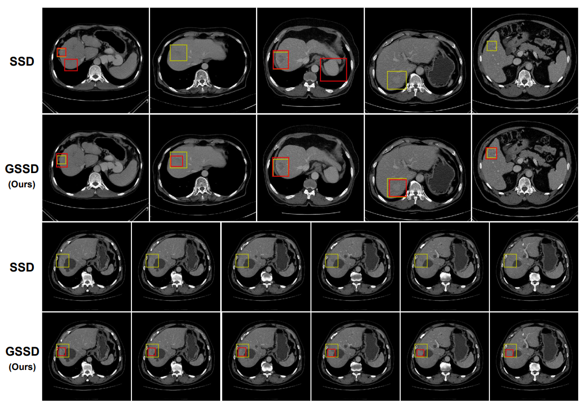
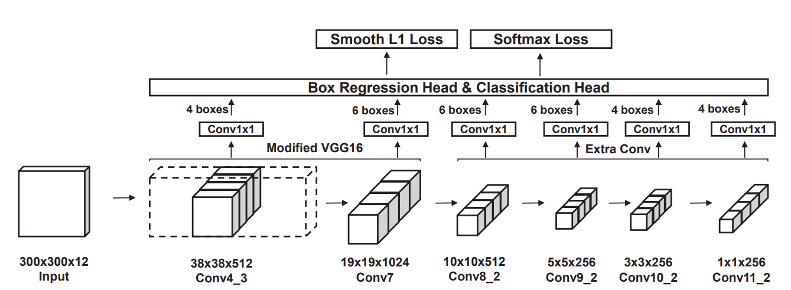

# Grouped SSD (GSSD) for liver lesions detection from multi-phase CT 

**Note: the [MICCAI 2018 paper](https://arxiv.org/abs/1807.00436) only covers the multi-phase lesions detection part of this project. The liver segmentation with U-net is currently WIP.**

Pixel-wise liver segmentation & multi-phase lesions detection from CT image in PyTorch.

This repo uses in-house industrial CT dataset, so the code for data loading is little nasty & unstructured, and I cannot release the dataset.

But structures of the liver segmentation data are nearly identical to 3Dircadb (http://www.ircad.fr/research/3dircadb/). And the lesions detection dataset looks like the figure 1 from our [MICCAI 2018 paper](https://arxiv.org/abs/1807.00436).

Assumes 512x512 slices of dicom CT image and their corresponding binary segmentation masks.

The original SSD implementation is hard-forked from [here](https://github.com/amdegroot/ssd.pytorch).
