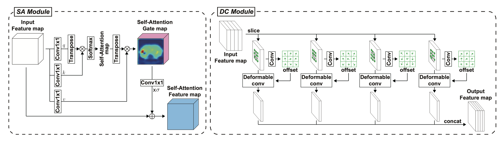
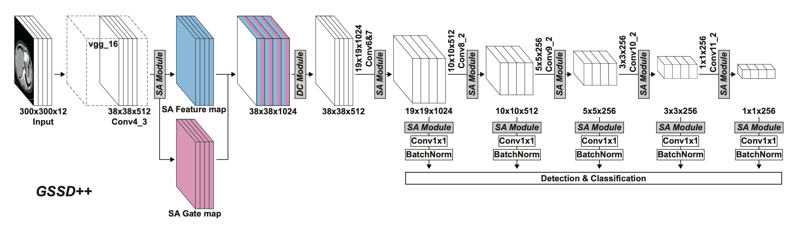
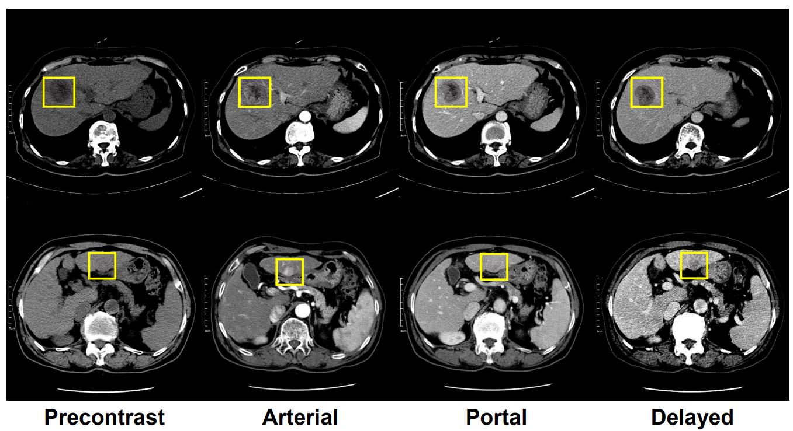
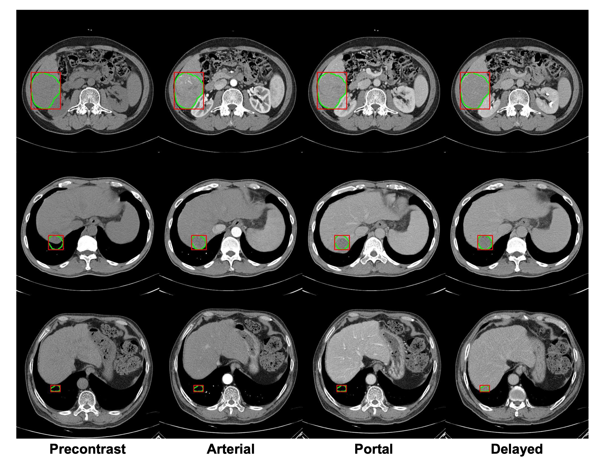
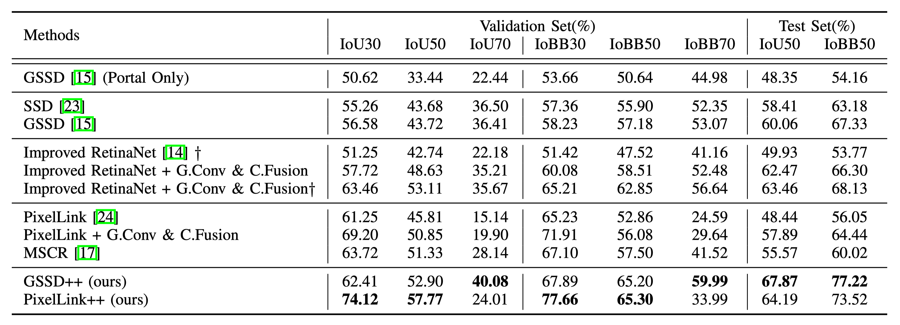
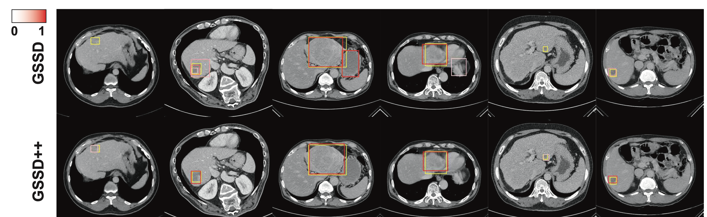
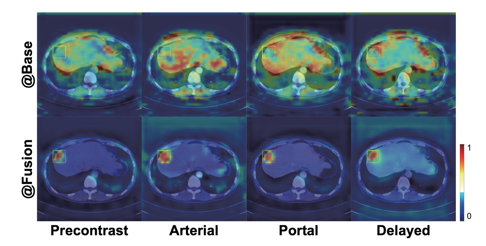

# Grouped SSD (GSSD) and GSSD++ for liver lesion detection from multi-phase CT

This repository is an official PyTorch implementation of the papers:

> Sang-gil Lee, Jae Seok Bae, Hyunjae Kim, Jung Hoon Kim, Sungroh Yoon. "Liver Lesion Detection from Weakly-labeled Multi-phase CT Volumes with a Grouped Single Shot MultiBox Detector." _MICCAI_ (2018).
>[[arxiv]](https://arxiv.org/abs/1807.00436)
>

> Sang-gil Lee, Eunji Kim, Jae Seok Bae, Jung Hoon Kim, Sungroh Yoon. "Robust End-to-End Focal Liver Lesion Detection using Unregistered Multiphase Computed Tomography Images." _IEEE TETCI_ (2021).
>[[arxiv]](https://arxiv.org/abs/2112.01535)
>
>

## Overview
This project provides an application of high-speed single-stage object detection models (e.g., SSD) to a computer-aided diagnosis (CAD) of focal liver lesions.

The use of single-stage detection model enables real-time plug-in support to the CAD toolkit in an interactive manner. This helps radiologists to focus on the machine-predicted region of interest and can reduce human error to the small and hard-to-see lesions.

GSSD and GSSD++ present custom-designed neural submodules (grouped convolutions, 1x1 channel fusion, and an attention-guided multiphase alignment of the unregistered CT images) to maximize performance designed for the medical object detection from the multi-phase CT images.

## Data

This repo uses multi-phase CT dataset collected from a university hospital, which is unfortunately outside of my authority to release it to the public.

During the custom data preparation, we followed the data structure of the liver segmentation label nearly identical to 3Dircadb (http://www.ircad.fr/research/3dircadb/).

The input data of the lesion detection and the corresponding label look like the figures from our [MICCAI 2018 paper](https://arxiv.org/abs/1807.00436).

`ssd_liverdet/train_lesion_multiphase_v2.py`: GSSD or GSSD++ training for liver lesion detection. Assumes 4-phase 512x512 slices of dicom CT image and their corresponding bounding box annotations.

`ssd_liverdet/train_lesion_multiphase_v2_pixellink.py`: PixelLink++ training for liver lesion detection. Assumes 4-phase 512x512 slices of dicom CT image and their corresponding bounding box annotations.

## Performance

GSSD++ and PixelLink++ exhibit state-of-the-art detection results measured by IoU and IoBB under various overlap thresholds. Our models also provide robustness to registration mismatch of the multi-phase data using the attention-guided multi-phase alignment module.

## Visualization

The following figures visualize the detection output and the attention map from GSSD++. 

## Reference
The original SSD implementation is hard-forked from [here](https://github.com/amdegroot/ssd.pytorch).

PixelLink implementation is hard-forked from [here](https://github.com/cheerss/PixelLink-with-pytorch).
